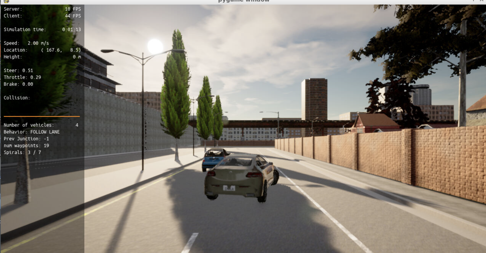

# Control and Trajectory Tracking for Autonomous Vehicle

## Overview.
The project develops a controller to make a self-driving car follow a trajectory. 
Software is developed based on this [repository](https://github.com/udacity/nd013-c6-control-starter/tree/master).

 The baseline software is in `nd013-c6-control-starter/project/pid_control`. These files are modified:
 - `pid_controller.h`, `pid_controller.cpp`
   - This file includes a class to execute PID control. The class calculates error between desired value and actual value, and feedback values to reduce the error.
 - `main.cc`
   - This main function executes planner and controller to make self-driving car drive in simulation environment. 

## Implementation and Simulation Result
This figure shows a simulation result using Carla. 2 PID controllers are implemented to track trajectory generated by a planner:
- `throttle controller` in `main.cpp`
  - Set error is between desired velocity and actual velocity.
  - Output command is throttle.
    - if throttle is positive value, it is deal with like gas pedal.
    - if throttle is negative value, it is deal with like brake pedal.
- `steering angle controller` in `main.cpp`
  - Set error is between desired yaw angle and actual yaw angle. Desire yaw angle is an view angle from vehicle position to closest target points in a trajectory. If the error is zero, lateral position error will be zero and vehicle yaw angle will be along with the trajectory.
  - Output is steering angle.

## Analyze of PID controller

## Elaboration of a Critical Analysis of the Controller
A way to automatically tune the PID parameters.
Model free controller's pros/cons.
PID controller improvement.
