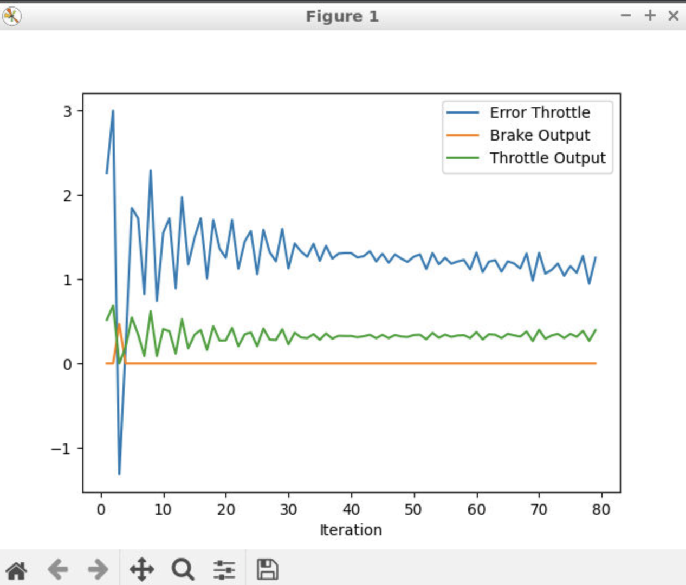
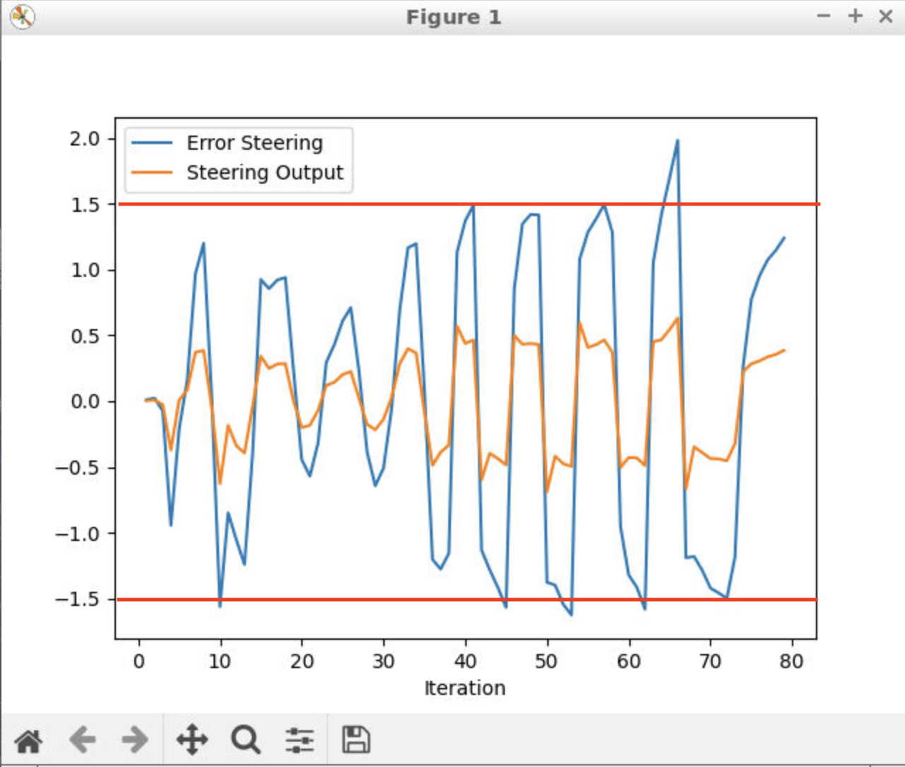
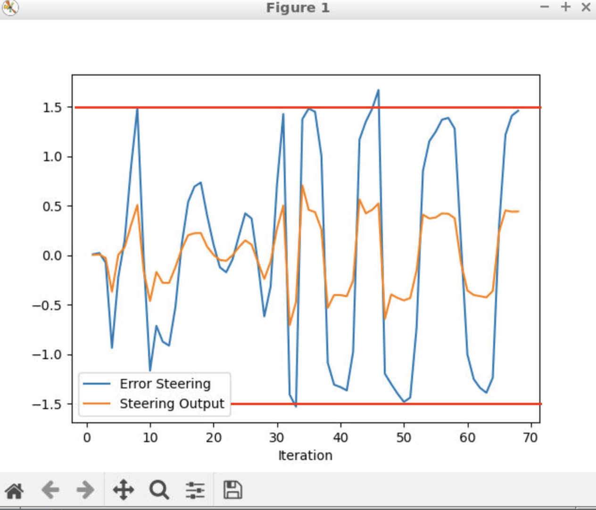

# Control and Trajectory Tracking for Autonomous Vehicle

## Overview.
The project develops a controller to make a self-driving car follow a trajectory. 
Software is developed based on this [repository](https://github.com/udacity/nd013-c6-control-starter/tree/master).

 The baseline software is in `nd013-c6-control-starter/project/pid_control`. These files are modified:
 - `pid_controller.h`, `pid_controller.cpp`
   - This file includes a class to execute PID control. The class calculates error between desired value and actual value, and feedback values to reduce the error.
 - `main.cc`
   - This main function executes planner and controller to make self-driving car drive in simulation environment. 

## Implementation and Simulation Result
This figure shows a simulation result using Carla. 2 PID controllers are implemented to track trajectory generated by a planner:
- `throttle controller` in `main.cpp`
  - Set error is between desired velocity and actual velocity.
  - Output command is throttle.
    - if throttle is positive value, it is deal with like gas pedal.
    - if throttle is negative value, it is deal with like brake pedal.
- `steering angle controller` in `main.cpp`
  - Set error is between desired yaw angle and actual yaw angle. Desire yaw angle is an view angle from vehicle position to closest target points in a trajectory. If the error is zero, lateral position error will be zero and vehicle yaw angle will be along with the trajectory.
  - Output is steering angle.

## Analyze of PID controller
This figure shows throttle control result. The error of throttle means velocity error (m/s). Since the output is oscillating, this P gain (Kp set in `main.cpp`) can be reduced. Also, since the error is constant, I gain (Ki set in `main.cpp`) may be increased.

This figure shows steering angle control result. The error of steering control means yaw agnle error (rad).

This figure shows a result of increasing D gain (Kd set in `main.cpp`), because output is oscillating and P gain cannot be adjusted. The error is improved.

## Elaboration of a Critical Analysis of the Controller
These PID parameters can be selected by using simulation. For example, the parameters are sampled randomly and choose the best of them. The [twiddle](https://martin-thoma.com/twiddle/) algorithm also works for auto tuning.

Model free controller's pros/cons are:
- Pros
  - No need to make model
  - Easy to adjust parameters e.g. if we want smooth acceleration more than position accuracy, it is easy to adjust parameters.
- Cons
  - If we don't have simulators, it is difficult and takes time to adjust parameters. 
  - Depends on which value is set as error, there is possibility.

PID controller improvement idea is:
- Since the actuator that accelerates and the actuator that decelerates after giving the throttle command value are different, we want to use separate PID controllers are used.
- Lateral control
  - We want to provide two PID controllers to compensate for lateral position error and yaw angle error.

